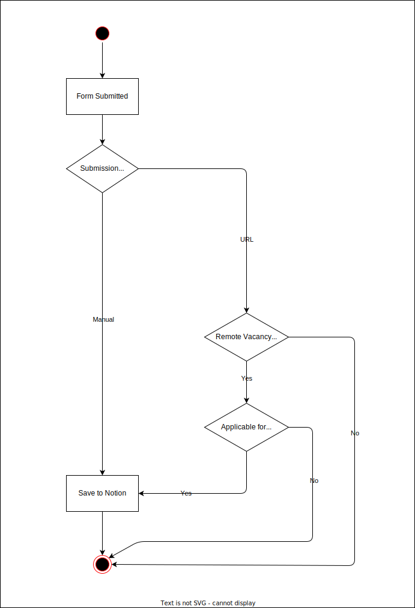
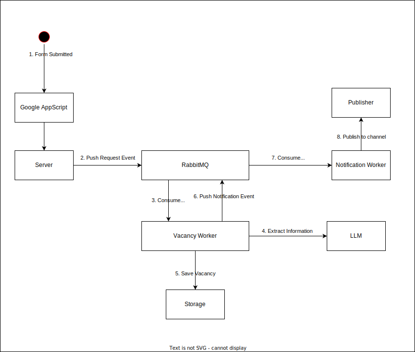

# IDN Remote Entry

This system handles submissions from the [Submit Remote Job for Indonesian Talents](https://docs.google.com/forms/d/e/1FAIpQLSczxOnMSt-sK9X5e4tbccblbml0ik1r2fHKKCW-FST3hls5uQ/viewform?pli=1) form.

We opted to use Google Forms instead of creating a custom web app because it is much easier to set up and comes with built-in Google authentication. Since our primary goal is to simplify the process for the community to submit remote vacancies, this setup should be sufficient.

Checkout the REST API documentation for this system [here](./docs/rest_api.md).

Below is the business logic for this system:



Below are the high-level architecture of this system:



There are three main components in this system:

- *Server* => handle incoming request and delegate to vacancy queue
- *Vacancy Worker* => consume submitted vacancy queue, handle the extraction information from url vacancy and publish to notification queue. To extract the information from submitted url vacancy, will do the following:
  - Check if the url is has own parser registry
  - If the url is has own parser registry, use the parser registry to get html body and forward to LLM extract the information.
  - If the url is not has own parser registry, capture screenshot of the full page url web and forward to LLM to do the OCR.
- *Notification Worker* => consume notification queue and publish to channel

In production, we use Notion as storage and Whatsapp as channel. However in local development, we use local `.jsonl` as storage and email mailpit as channel.

## Getting Started

To run this project locally, make sure you have Docker installed on your local machine. Then run the following command:

```bash
make run
```

The server will start running on `http://localhost:9864`.

> ⚠️ Caution:
>
> This command will start download `minicpm-v:8b` 5.5GB of Ollama model, make sure you have enough disk space and RAM to run.
>
> The reason why we use `minicpm-v:8b` is because its smaller model that capable to extract text information and process OCR on web screenshot.
